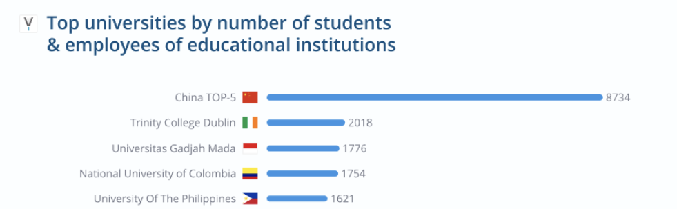
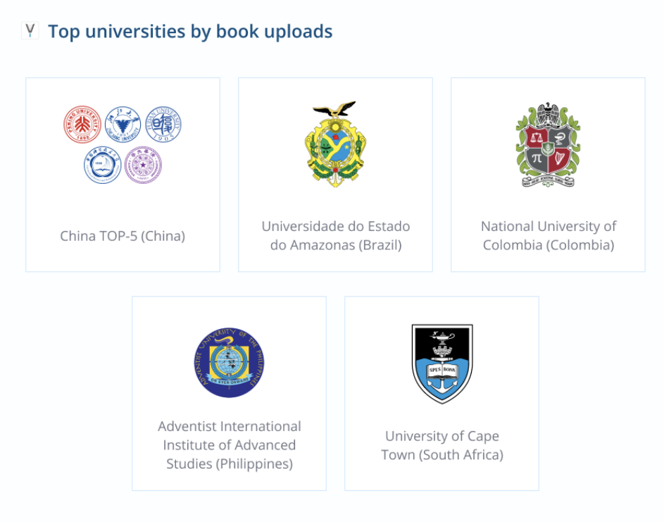
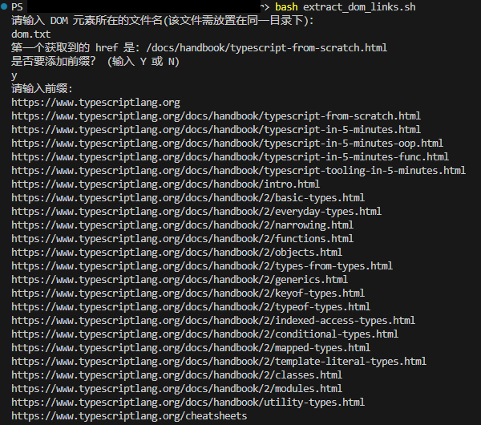
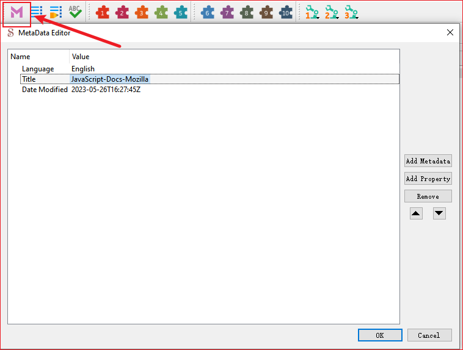
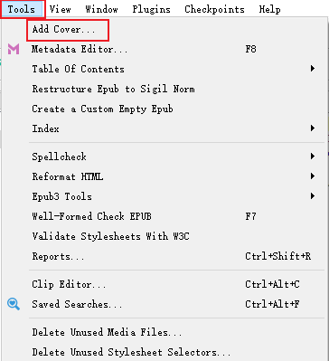
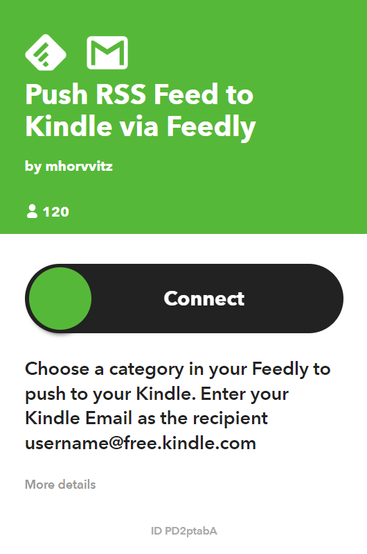
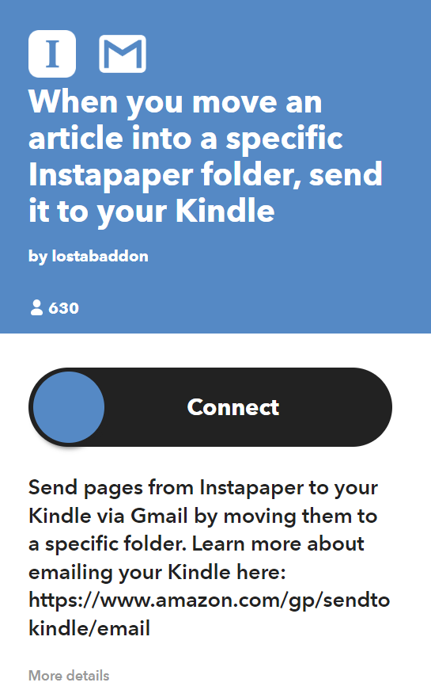

# 我的电子书阅读不完全解决方案

## 阅读设备

## 电子书的获取

以下不包含从电子书商城购买下载的内容.下面的内容可能涉及到侵权等,如果资金允许,建议从正规渠道购买下载.

### 从网上获取

#### Z-Library

该组织将自己描述为“世界上最大的电子书图书馆”，以及“世界上最大的科学文章商店”.并作为一个由捐赠维持的非营利组织运营。但是 2022 年 11 月，该网站的域名被美国司法部查封..在 Z-Library 的用户群中,中国用户遥遥领先于其他国家(来自 Z-Library 博客 Worldwide Statistics: How Students and Educators Use Z-Library 中的数据).





##### 获取 Z-Library

- 通过域名访问

  Web:[https://singlelogin.re](https://singlelogin.re/)

  TOR:[http://loginzlib2vrak5zzpcocc3ouizykn6k5qecgj2tzlnab5wcbqhembyd.onion](http://loginzlib2vrak5zzpcocc3ouizykn6k5qecgj2tzlnab5wcbqhembyd.onion/)

  I2P:[http://zlib24th6ptyb4ibzn3tj2cndqafs6rhm4ed4gruxztaaco35lka.b32.i2p](http://zlib24th6ptyb4ibzn3tj2cndqafs6rhm4ed4gruxztaaco35lka.b32.i2p/)

  通过域名访问里面的部分内容可能无法查看,如博客,书单等页面.这些内容可以通过使用个人域名访问

  以上域名随时可能被回收,如果无法访问可以使用电子邮件获取,或者从从官方发布的最新域名中获取.[官方频道](https://t.me/zlibrary_official)

- 通过电子邮件获取

  你可以使用任意邮箱,发送任意内容到 blackbox@zlib.se,将在 3-5 分钟内收到你 Z-Library 个人的域名。如果没有收到邮件,前往被拦截的邮件中查看.在个人域名中可以查看Z-Library 的博客书单等.

#### Anna's Archive

[Anna's Archive](https://annas-archive.org/) 是图书馆创世纪和 Z-Library 影子图书馆的备份.Z-Library 被关闭后一个比较流行的替代站点.可以直接访问

### 自制电子书

如如果你平时经常查看一些文档，但是这些文档又没有电子书的，都是你可以通过自制电子书来在你的kindle上查看这些文档内容.

自制电子书的软件:[Sigil](https://sigil-ebook.com/sigil/),Github 上 star 最多的电子书软件

最简单的方法：

将链接输入 KTool 中生成并推送到 Kindle 中。但是导入链接一次最多导入 30 个，且生成的电子书只能以 30 个链接为一本，链接增加则会分成几本书。

##### 获取文章链接

我写了个 sh 脚本通过解析 dom 来获取文档链接。[脚本下载地址](https://github.com/huyixi/Tools.git)



##### 获取文档内容

通过 python 爬虫爬取所有文章内容，并将其写入指定的html文件中


##### 制作电子书

##### Sigil

通过生存的html文件来制作电子书

1.导入 html 文件

导入过程可能遇到错误。


如果错误较少，可以采用手动更改的方式修改错误。如果错误太多了，可以使用下面的方法 percollate 来自做电子书。

2.生成目录

生成目录方便快速导航到指定页面


3.编辑元数据

在这里编辑图书标题，作者名等等



4.添加封面

添加封面，以便 Kindle Library 显示略缩图。




##### percollate

[percollate](https://github.com/danburzo/percollate). A command-line tool to turn web pages into readable PDF, EPUB, HTML, or Markdown docs.

根据官方文档进行安装

```shell
percollate epub [bookname].epub [section1].html [section2].html
```

[bookname].epub ：生成的电子书文件名

[section].html：图书的内容


推送 RSS 到 Kindle

付费平台：[Qi Reader](https://www.qireader.com/)

搭建较为方便，但是需要一定费用

免费方案：

- KindleEar

  不需要付费，但需要一张信用卡部署

- IFTTT

  相关平台还有 [zapier](https://zapier.com/)






- Instapaper


## 电子书管理

### Calibre

## 电子书的传输

### Send to Kindle

[Send to Kindle](https://www.amazon.com/sendtokindle)

使用官方的Send to Kindle 工具传输

#### Instapaper

[Instapaper](https://www.instapaper.com)

#### KTool

### 邮件传输


### 网页传输

将文件拖拽到网页即可传输

https://www.amazon.com/sendtokindle

### 插件传输

### Calibre 传输

使用

## Resource

[书伴](https://bookfere.com/)